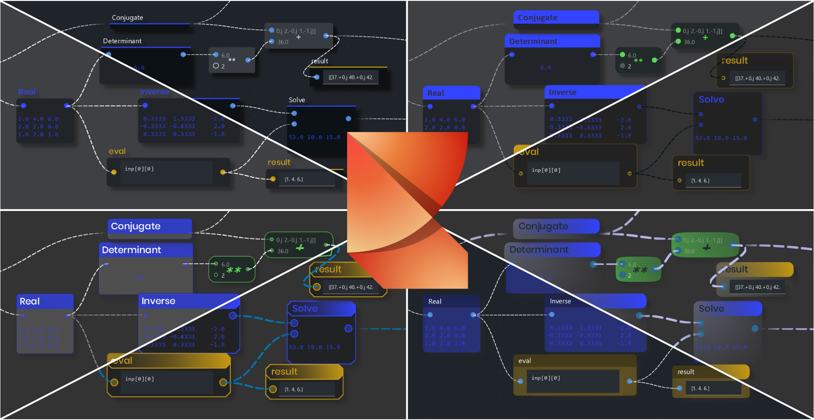

<p align="center">
  
</p>

# A simple flow-based visual scripting env for Python

**Ryven combines flow-based visual scripting with Python. It provides you with absolute freedom for what your nodes can execute as well as an easy-to-use system for programming them. While there are some example node packages, you will most likely rely mostly on your own nodes.**

Ryven is now based on [ryvencore-qt](https://github.com/leon-thomm/ryvencore-qt), a guide for Ryven can be found [here](https://ryven.org/guides.html#/).

**Installation**

```
pip install ryven
```

and now you can launch Ryven by running `ryven` on your terminal, and RyvenConsole via `ryven_console`.

# quick start

A super quick intro to Ryven. If you want to know more, [visit guide on the website](https://ryven.org/guide#/).

**editor usage**

Open Ryven by typing `ryven` in your terminal (or running `Ryven.py` with python), and create a new project. Import some nodes via `File -> Import Example Nodes` and select `std/nodes.py`. You should now see a long list of nodes on the left. Drag and drop them into the scene and get a feeling for how they work, everything is being executed at realtime. For instance, drag two `val` nodes into the scene, wire them together with a `+` node and display the result in a `result` node. Now replace one of them with a slider node generating real numbers. You can also get an interactive nodes list preview inside the scene by right-clicking. You can pan around also with the right mouse button, and zoom via `ctrl + scroll`.  You can also create new scripts (with flows) by clicking `File -> Scripts -> New`.

Now let's check out the small example projects: open a new Ryven window and load one of them. Take a closer look and understand what they do.

At this point you are ready to start building your own nodes.

**defining nodes**

Navigate to the `~/.ryven/packages/` directory and create a new folder `<your_package_name>`. Inside this folder create a python file `nodes.py` and fill it with the following content:

```python
from NENV import *

# your node definitions go here

export_nodes(
    # list your node classes here, as tuple
)
```

and now you can define your own node classes. Reference the ones you want to expose to Ryven in the `export_nodes` function (for example `export_nodes(MyNode, )` or `export_nodes(Node1, Node2, )`). Let's define two basic nodes:

one which generates random numbers

```python
from random import random

class RandNode(Node):
    """Generates scaled random float values"""
    # the docstring will be shown as tooltip in the editor

    title = 'Rand'  # the display_title is title by default
    tags = ['random', 'numbers']  # for better search
    
    init_inputs = [  # one input
        NodeInputBP(dtype=dtypes.Data(default=1))
        # the dtype will automatically provide a suitable widget
    ]
    init_outputs = [  # and one output
        NodeOutputBP()
    ]
    color = '#fcba03'

    def update_event(self, inp=-1):
        # update first output
        self.set_output_val(0, 
            random() * self.input(0)  # random float between 0 and value at input
        )
```

and another one which prints them

```python
class PrintNode(rc.Node):
    title = 'Print'
    init_inputs = [
        rc.NodeInputBP(),
    ]
    color = '#A9D5EF'

    def update_event(self, inp=-1):
        print(self.input(0))
```

and that's it! Go ahead and import your nodes package in Ryven. Place both in the scene and connect the `Rand` node to your `Print` node.

***

## Features

Following is a list of some main features:

#### simple nodes system
All information about a node is part of its class. A minimal node definition can be as simple as this

```python
class PrintNode(Node):
    """Prints your data."""

    title = 'Print'
    init_inputs = [
        NodeInputBP()
    ]
    color = '#A9D5EF'

    def update_event(self, inp=-1):
        print(self.input(0))
```

<!--
#### macros / subgraphs
You can define *macros* which get registered as nodes themselves


Macros are like all other scripts, so they have their own flow, plus input and output node

-->

#### right click operations system for nodes
which can be edited through the API at any time.
```python
class MyNode(Node):
    ...

    def a_method(self):
        self.actions['do something'] = {
            'method': self.do_sth,
        }

    # with some method...
    def do_sth(self):
        ...
```

#### Qt widgets
You can add custom QWidgets for your nodes, so you can also easily integrate your existing Python-Qt widgets.
```python
class MyNode(Node):
    main_widget_class = MyNode_MainWidget
    main_widget_pos = 'below ports'  # alternatively 'between ports'
    # ...
```
<!-- - **convenience GUI classes** -->

#### many different modifiable themes


Also light themes!

#### exec flow support
While data flows are the most common use case, exec flows (like [UnrealEngine BluePrints](https://docs.unrealengine.com/4.26/en-US/ProgrammingAndScripting/Blueprints/)) are also supported. 
<!-- While while it can lead to issues when using exec connections in data flows, conceptually this also works and has proven to be also really powerful if applied correctly. -->

#### stylus support for adding handwritten notes
<!--  -->
<p align="center">
  
</p>

#### rendering flow images

#### logging support
```python
import logging

class MyNode(Node):
    def somewhere(self):
        self.logger = self.new_logger('nice log')
    
    def update_event(self, inp=-1):
        self.logger.info('updated!')
```

#### variables system
with an update mechanism to build nodes that automatically adapt to change of variables.

```python
class MyNode(Node):
    
    def a_method(self):
        self.register_var_receiver('x', method=self.process)

    # with some method...
    def process(self, val_of_x):
        # processing new value of var 'x'
        ...
```

Also visit the [website](https://ryven.org) if you haven't been there already.

Ryven is now built on top of [ryvencore-qt](https://github.com/leon-thomm/ryvencore-qt), a framework for building Ryven-like editors. Nodes from Ryven are easily migratable to other ryvencore-qt editors.

## Contributions

Contributing guidelines: [here](https://github.com/leon-thomm/Ryven/blob/dev/CONTRIBUTING.md).

To support the development of this project, which will decide its future, check out the [ryvencore-qt](https://github.com/leon-thomm/ryvencore-qt) repo where the main development is happening. Also notice that there's a *discussions* area in this repo).

Particularly effective ways to contribute outside direct development of the software include

- creating examples
- creating tutorials
- creating node packages
- improving documentation

The docs page on the website is made with [Docsify](https://github.com/docsifyjs/docsify/), so you can improve it by simply editing the markdown. The whole [website sources](https://github.com/leon-thomm/ryven-website) are also on GitHub.

Cheers.
